> **English** | **[简体中文](lang/zh-CN/ARCHITECTURE.md)** | **[日本語](lang/ja/ARCHITECTURE.md)** | **[한국어](lang/ko/ARCHITECTURE.md)**

# ATLAS Architecture

System architecture for ATLAS V3.1.3. Two-layer design: an outer agent loop handles tool-call orchestration, and an inner V3 pipeline generates diverse code candidates with build verification and energy-based selection.

---

## 1. System Overview

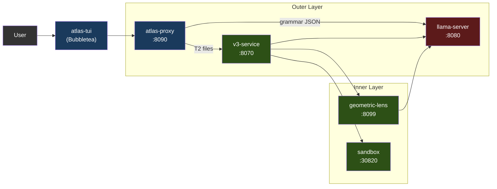

Services run as containers via Docker Compose (recommended) or as local processes via the `atlas` launcher. Only llama-server uses the GPU. Everything else runs on CPU.

The chat front-end is the **atlas-tui** (Bubbletea): a native Go terminal UI consuming `/v1/agent` (per-turn chat SSE) and `/events` (global typed-envelope feed for the pipeline pane). Launch with `atlas` (interactive default) or `atlas tui` (explicit). Pipeline pane shows V3 stages live; chat pane renders assistant markdown via glamour; slash commands `/add /diff /commit /run` etc. handle local file context and shell-out. Mode-aware input (chat / `!bash` / `/slash`) with a hint dropdown.

Third-party clients that want tool calls + V3 pipeline target `/v1/agent` directly; `/v1/chat/completions` is a passthrough to llama-server (see §3). The contract is documented in [API.md](API.md).

### 1.1 Supported Accelerators

llama-server is the only GPU-using service; every other ATLAS service runs on CPU (proxy is Go, v3-service / geometric-lens / sandbox are Python). That keeps the multi-backend surface small — adding a new accelerator means a new Dockerfile + an entrypoint env-var branch, not changes to the pipeline.

| Backend | Status (V3.1.x) | Image / build path | Compose override | Tested cards |
|---|---|---|---|---|
| **CUDA** (NVIDIA) | Supported (since V3.1.0) | `inference/Dockerfile.v31` → `atlas-llama` | (default) | RTX 5060 Ti 16GB (canonical). The published image is compiled for Blackwell (compute capability 12.0/12.1) only; earlier generations need a local rebuild — see [SETUP.md](SETUP.md) |
| **ROCm / HIP** (AMD) | Community-tested (since V3.1.1) | `inference/Dockerfile.rocm` → `atlas-llama-rocm` | `docker-compose.rocm.yml` | RX 7900 XTX (community smoke-test, GH #26) |
| **Metal** (Apple Silicon) | Supported ([#32](https://github.com/itigges22/ATLAS/issues/32)) | Hybrid: native llama-server (Metal) + Docker for the rest (macOS can't passthrough GPU to containers) | `docker-compose.macos.yml` | M-series; Q4_K_M on ≤16 GB, Q6_K on ≥24 GB unified |
| **Vulkan** (cross-vendor fallback) | Preview | `inference/Dockerfile.vulkan` → `atlas-llama-vulkan` | `docker-compose.vulkan.yml` | lavapipe CPU boot path (smoke-tested); no real-GPU validation yet |
| **SYCL** (Intel Arc) | Roadmap — Intel Arc uses `vulkan` today | TBD | TBD | — |

**Backend selection happens at install time, not runtime.** `atlas init` runs `tier.detect_gpu()` (see `atlas/cli/commands/tier.py`), picks the largest-VRAM GPU across all detected vendors (override with `ATLAS_GPU_VENDOR` / `ATLAS_GPU_INDEX`), and writes `ATLAS_BACKEND={cuda|rocm|metal|vulkan}` into `.env`. Detection resolves to the packaged native backend when one exists: CUDA for NVIDIA, ROCm for AMD on x86_64, the hybrid Metal path on macOS. When no native backend is packaged for the host (Intel Arc, AMD on arm64, unrecognized vendors), the wizard offers the Vulkan universal fallback (default-yes): one image covers AMD, Intel, Adreno, MoltenVK, and the lavapipe CPU rasterizer, at roughly 20–40% below a tuned native backend. It refuses — rather than writing a `.env` that won't boot — only when nothing usable exists. Each backend has its own pre-built image; users don't run a fat image that ships every backend's libraries.

**Bring-your-own-model surface (V3.1.1).** `atlas lens check` is a cheap pre-flight against a running llama-server that reports whether the loaded model is Lens-compatible. `atlas lens build --samples <path>` wraps `geometric-lens/geometric_lens/training.py` to train fresh C(x) (`cost_field.pt`) **and** G(x) (XGBoost) artifacts at the model's native embedding dim. Together they let users swap in non-default GGUFs without forking the lens code — the C(x) constructor accepts arbitrary `input_dim`, so the only thing that changes per-model is the trained weights. See [CLI.md § atlas lens](CLI.md#atlas-lens) for the user-facing flow; `atlas lens publish` (or the combined `atlas publish`) uploads the artifacts to HuggingFace and opens the registry PR that pins their hashes.

**What's vendor-agnostic** (works on every backend): grammar-constrained JSON, self-embeddings (`/embedding`), per-layer hidden states, ASA control vectors (loaded by llama.cpp's `control_vector_load` regardless of backend), KV cache quantization, the entire outer agent loop, V3 pipeline, Geometric Lens, and sandbox.

**What differs per backend:**
- **Flash attention.** CUDA + ROCm: full support. Metal: limited (llama.cpp Metal backend supports flash-attn for some head sizes; defaults to off if unsupported). Vulkan: driver-dependent.
- **Pinned host memory.** `GGML_CUDA_NO_PINNED` applies to CUDA + ROCm (HIP mirrors the CUDA path at the GGML compat layer). Metal/Vulkan don't use the CUDA/HIP pinning path.
- **Multi-GPU + tensor parallelism.** V1 supports single-GPU only on every backend; multi-GPU is GH #34, not bound to a specific vendor.
- **Apple unified memory.** macOS shares GPU+system memory; "VRAM" math is actually "16 GB total minus OS + apps." See §7.

The K3s deployment path (`scripts/install.sh`, manifests in `templates/`) is CUDA-only as of V3.1.1 — ROCm K8s recipe is deferred to the V3.2 infra list (needs `/dev/kfd` + `/dev/dri` hostPath mounts and `render`/`video` group membership, the cluster-level equivalents of `docker-compose.rocm.yml`).

---

## 2. Services

| Service | Port | Language | Purpose |
|---------|------|----------|---------|
| **llama-server** | 8080 | C++ (llama.cpp) | LLM inference (CUDA / ROCm / Metal / Vulkan; SYCL on roadmap — see §1.1), grammar-constrained JSON, self-embeddings, per-layer residual hidden states |
| **atlas-proxy** | 8090 | Go | Agent loop, tool-call routing, tier classification, `/v1/agent` SSE, `/events` typed SSE, `/cancel`. `/v1/chat/completions` passes through to llama-server unchanged. |
| **atlas-tui** | (client) | Go | Bubbletea TUI; consumes `/events` and `/v1/agent` SSE streams. |
| **v3-service** | 8070 | Python | V3 pipeline HTTP wrapper (PlanSearch, DivSampling, PR-CoT, etc.) |
| **geometric-lens** | 8099 | Python (FastAPI) | C(x) energy scoring, G(x) XGBoost quality prediction, RAG/project indexing; owns the SQLite state store (`SQLITE_DB_PATH` on the `lens-state` volume) backing the pattern cache, co-occurrence graph, task queue, and router state |
| **sandbox** | 30820 (host) / 8020 (container) | Python (FastAPI) | Isolated code execution, compilation, linting, test running |

---

## 3. atlas-proxy (Outer Layer)

The proxy is the entry point for chat front-ends. It accepts user messages on `/v1/agent` (typed event stream — what the TUI uses) and runs an internal agent loop that calls llama-server, parses tool calls, executes them, and streams events back. The `/v1/chat/completions` endpoint is a transparent passthrough to llama-server; it is kept for SDK compatibility and does not run the agent loop. See [API.md](API.md) for the full event-type catalogue.

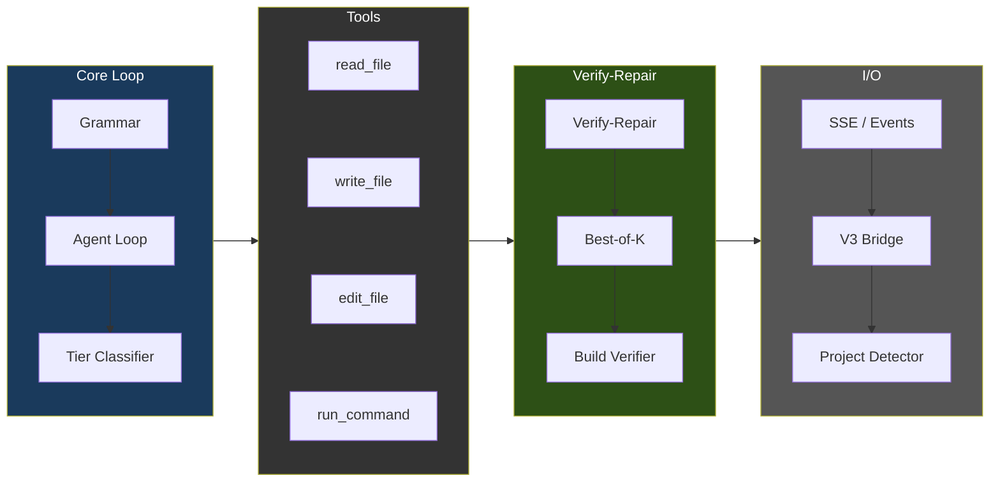

### Agent Loop Flow

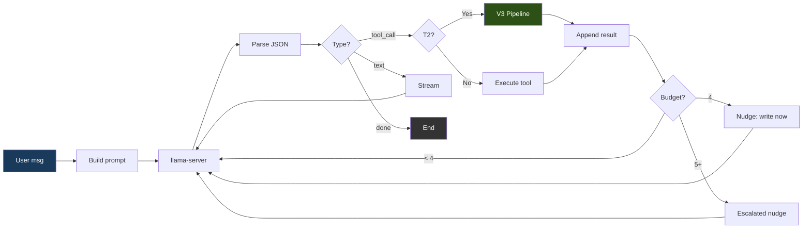

### Grammar Enforcement

Every model output is constrained toward one of three valid JSON shapes:

```json
{"type": "tool_call", "name": "<tool_name>", "args": {...}}
{"type": "text", "content": "<message>"}
{"type": "done", "summary": "<summary>"}
```

In the default `strict` mode the proxy sends a full JSON schema — `oneOf` with `additionalProperties: false`, tool names enumerated from the registry — which llama-server enforces as a grammar during token generation. Grammar constraints make malformed output rare, not impossible: `ATLAS_GRAMMAR_MODE=loose` sends `{"type":"json_object"}` only (valid JSON, no shape enforcement — some models require it), and the response token cap can truncate mid-JSON. The proxy treats parsing as fallible — it recovers JSON from prose/`reasoning_content`, detects truncated tool args before execution, feeds targeted parse-failure descriptions back, and breaks the loop after three consecutive failures.

### Tools

14 tools registered in `proxy/tools.go`:

| Tool | Purpose | Read-only |
|------|---------|-----------|
| `read_file` | Read file contents (with optional offset/limit) | Yes |
| `outline_file` | List a file's top-level functions/classes with line ranges, no bodies (tree-sitter for `.py`, best-effort scan otherwise). The surgical-read entry point: outline first, then `read_file` with offset/limit | Yes |
| `write_file` | Create a NEW file (rejected for existing files >5 lines — see safety limits) | No |
| `edit_file` | Surgical inline string replacement (old_str/new_str) for ≤10-line changes | No |
| `ast_edit` | Whole-function/class/HTML-element rewrite via tree-sitter selector (`function:NAME`, `class:NAME`, `<tag>`); REQUIRED over edit_file for whole-node swaps. GH #39, .py/.html/.htm only in v1 | No |
| `delete_file` | Delete file or empty directory (forces loop exit after) | No |
| `move_file` | Move or rename a file within the workspace (e.g. `index.html` → `templates/`). Pure relocation — bypasses the V3/surgical-edit gate, refuses to clobber an existing destination. The supported path for "reorganize the files" since shell `mv`/`cp` are refused | No |
| `find_file` | Regex search by file **name** / path (cheap existence + locate). Distinct from `search_files` which greps inside file contents. | Yes |
| `search_files` | Regex search across file contents (max 200 matches, skips .git/node_modules) | Yes |
| `list_directory` | List directory contents with type and size | Yes |
| `run_command` | Execute shell command via sandbox container; 5 min timeout cap | No |
| `run_background` | Start a long-running process (e.g. `python app.py`) in the sandbox; returns a `job_id` immediately | No |
| `tail_background` | Fetch new stdout/stderr from a backgrounded job by `job_id` | Yes |
| `stop_background` | SIGTERM/SIGKILL a backgrounded job by `job_id` | No |

### Tool-selection bias mitigations

A measured reference deployment showed a bias toward `edit_file` over
`ast_edit` even when `ast_edit` was correct (BiasBusters arxiv 2510.00307 —
embeddings of nearby tool names compete; descriptions matter more than names).
Four model-independent defenses compose in the proxy:

1. **Description rewrite** (`proxy/tools.go`). edit_file's description
   warns against whole-file/whole-function use; ast_edit's description
   says REQUIRED for >10-line / whole-node swaps; write_file's says
   NEW files only.
2. **Conditional GBNF grammar** (`proxy/grammar.go`,
   `proxy/agent.go:stepExclusions`). When a write_file is rejected on
   an existing .py/.html/.htm file >5 lines, the next LLM call is
   constrained by a GBNF grammar that bans edit_file and write_file
   from the tool-name production. The model physically cannot emit
   them. Restriction expires after one decision.
3. **Per-step tool-list filter** (same trigger). An ephemeral
   `[system note]` user message is injected reminding the model that
   ast_edit is the only structural-edit tool for this step.
4. **ASA steering vectors** (`geometric-lens/asa_calibration/`).
   Activation steering shifts the residual-stream distribution upstream
   so ast_edit is preferred even on first-attempt decisions before any
   rejection has fired. Auto-loaded by `inference/entrypoint-v3.1.sh`
   from `/models/ast_edit_steering.gguf` only when its `.model` sidecar
   matches the selected model—always-on after a compatible build via the workflow
   in `geometric-lens/asa_calibration/README.md`. Override path/scale/
   layer-range via `ATLAS_CONTROL_VECTOR*` env vars.

   **Per-model coupling.** Each ASA vector is trained
   against a specific model's residual-stream geometry. No cross-model
   fallback is safe. `atlas asa check` verifies the `.model` sidecar, probes
   the loaded embedding dimension, parses GGUF layer metadata, and reports
   `compat` / `needs-build` / `incompatible`. `atlas asa build` derives the
   extraction layer from the loaded model, writes the vector and marker, and
   runs inside the lens container. `atlas asa publish` refuses missing or
   mismatched markers before upload. See [CLI.md § atlas asa](CLI.md#atlas-asa).

### Per-File Tier Classification

Each `write_file`/`edit_file` call is classified independently:

| Tier | Max Turns | Action |
|------|-----------|--------|
| T0 (Conversational) | 5 | Text response only |
| T1 (Simple) | 0 (uncapped) | Direct write — no V3 overhead |
| T2 (Feature) | 0 (uncapped) | V3 pipeline fires |
| T3 (Hard) | 0 (uncapped) | V3 pipeline fires |

Tier caps are 0 (uncapped); the detector stack inside the loop decides when to break: lens regression (`agent_lens_intervention`), reasoning repetition (`agent_reasoning_intervention`), tool-call repetition (`agent_repeat_intervention`), path-aware error breaker, done-without-action gate, claim-check gate, plan adherence threshold, and the empty-response fallback. Operators can override with `ATLAS_MAX_TURNS=<n>` for one-off "fix the entire app" prompts — see `proxy/types.go::envOverrideMaxTurns`.

Classifier in `proxy/tools.go` (`classifyFileTier`); logic-pattern matcher in the same file (`hasLogicIndicators`).

**Always T1 (direct write):**
- Config files matched by name (e.g. `package.json`, `go.mod`, `pyproject.toml`, `dockerfile`, `docker-compose.*`)
- Data files by extension (`.json`, `.yaml`, `.yml`, `.toml`, `.csv`, `.xml`, `.env`)
- Style files (`.css`, `.scss`, `.less`)
- Documentation (`.md`, `.txt`, `.rst`) and shell scripts (`.sh`, `.bash`)
- Trivially-tiny files under **10 lines** (V3 has nothing to meaningfully diversify on at that size)
- Unknown extensions with no logic indicators

The exact config-file list and extension sets live in `proxy/tools.go:classifyFileTier`.

**T2 (V3 pipeline)** — file qualifies if it's ≥10 lines AND either:
- `hasLogicIndicators(content)` returns true — **2+ matches** across pattern families covering function/method definitions, control flow, error handling, Flask/FastAPI/Django routing, Express/Node API, React state/data, validation, database calls, JSX/React component patterns, and imports (the literal token list is in `proxy/tools.go:hasLogicIndicators`)
- OR the file has a recognized source-code / markup extension (`.py`, `.go`, `.rs`, `.ts`, `.tsx`, `.js`, `.jsx`, `.html`, `.htm`, …) and no logic indicators fired — gets the benefit of the doubt at T2 (covers minimal-but-real files like a 12-line component shell)

**T3 (Hard)** — currently classifier never emits T3 by itself; the cyclomatic-complexity refiner (`refineTierWithCC` via GH #39 point 2's `/internal/cyclomatic_complexity`) *escalates* on McCabe CC: to T2 at CC ≥ 8 (including from T1) and to T3 at CC ≥ 16. Never downgrades.

### Plan Mode (per-turn pre-flight)

Plan mode is a pre-flight planning step that runs once per agent turn before the first tool call: the planner samples candidate plans, scores them heuristically, and renders the winner into the system prompt, where an adherence gate auto-revises when the model thrashes off-plan. It cuts discovery thrashing and blocks no-evidence `done` by guarding on the plan's verify step.

See [PLAN_MODE.md](PLAN_MODE.md) for the full flow, components, tunables, skip conditions, cost, and testing matrix.

### Safety Limits

Operator-facing limits and the knobs that tune them. Internal steering guards (traceback localization, missing-module/missing-command/broken-inline-script/case-mismatch steers, symbol grounding, no-op/empty-content/syntax gates, doctype strip) live in `proxy/guardrails.go` and `proxy/agent.go`. The missing-command steer fires on `command not found` shell errors: the sandbox is non-root on a read-only base, so absent binaries can never be apt-installed at runtime — the steer says so and points at pip-installable equivalents or the preinstalled toolchains instead of letting the model re-run into the repetition breaker. The broken-inline-script steer fires when a `python -c` verification one-liner fails with a SyntaxError in the `-c` argument itself (a multi-statement `def`/`for` body jammed onto one line): the solution file may be correct while only the verify command is malformed, so it directs the model to move the test into a `.py` file rather than re-run the unparseable one-liner.

**Fast-path writes during active iteration.** V3 fires on the *first* write of a T2+ file (baseline generation). But once the model has written a file and just saw it fail a run, the next write is a targeted fix in an edit-test-fix loop — it skips V3 (still syntax-gated) and writes directly. V3's full pipeline is multi-minute per call and, on a file mid-debug, frequently completes without a usable result and falls back anyway; paying that latency per iteration throttles the loop to a handful of cycles. The fast-path keys off `SessionWrites[path]` plus a failed most-recent run referencing the file.

**Iteration vs. repetition.** The loop breakers distinguish a model *iterating toward a fix* from one *spinning*. `write_file` repetition is keyed on the target path **plus a whitespace-stripped content fingerprint**: reasserting the same draft collides and counts toward the threshold, but rewriting a file with materially different content (fixing successive compiler errors) produces distinct signatures and is not counted. When repetition *is* detected, the breaker **steers before it kills** — the first detection injects a corrective `[system note]` and the loop continues; only a second detection (the model repeated after seeing the nudge) ends the session. This replaced an immediate hard-stop that terminated legitimate iteration with the solution on disk but unverified.

| Limit | Value | Purpose |
|-------|-------|---------|
| Conversation trim | Sliding window sized to the slot: keep system + most-recent-user-instruction + the active file's content + as many trailing messages as fit `per-slot context − ATLAS_MAX_TOKENS − 2048 − slot/8` (the `slot/8` term is tokenizer slack: the chars/4 estimate under-counts dense code/JSON). The pinned instruction and file content are counted against the budget, not just re-injected. Floor: keep 8; hard ceiling via `ATLAS_AGENT_HISTORY_BUDGET`. If llama-server still rejects the prompt as over-context, the loop force-trims to the minimum window and retries once instead of killing the session | Prevent context overflow without dropping the file under edit |
| Redundant-read short-circuit | Whole-file re-read of an unchanged file returns an "already in context" pointer only while the content is still live; otherwise the full file is re-served (`ATLAS_DEDUP_READS=0` disables) | Avoid re-encoding an unchanged file every turn without the model editing blind |
| V3 interactive wall-clock cap | Single V3 pipeline call capped at `ATLAS_V3_TIMEOUT` (default 180s); on timeout the proxy falls back to the model's syntax-gated content (`0` disables) | Keep an interactive session responsive under a long repair stall |
| Per-turn reasoning budget | Cut the stream after ~6144 reasoning tokens (`ATLAS_REASONING_BUDGET`, 0 disables); recovery extracts an embedded tool_call or re-prompts | Bound reasoning spirals |
| write_file for existing files | Reject if file > 5 lines; on .py/.html/.htm the per-step grammar gate steers to `ast_edit` | Force surgical (`edit_file`) or whole-node (`ast_edit`) edits |
| Suspicious-shrinkage guard | Reject `ast_edit`/`edit_file` when `oldSize >= 100B` and `newSize < 64B` (`proxy/guardrails.go::validateNotSuspiciouslyShrunk`) | Catch destructive stub rewrites before they hit disk |
| ast_edit runaway-content guard | Reject when `content` > 8 KB AND > 4× the file size | Catch reasoning-leak blobs emitted as the replacement node |
| Error loop breaker | 3 consecutive failures | Stop runaway failure cycles |
| Exploration budget | Nudge at 4 consecutive read-only calls; escalated nudge at 5+. Reads always execute — the nudge steers the *next* turn toward a write | Push the model to write instead of exploring indefinitely |
| Command output truncation | stdout 8,000 chars, stderr 4,000 chars | Prevent context flooding |
| Search results | 200 matches max; file search skips files > 1 MB | Bound search cost |
| Truncation detection | JSON parse check on tool args | Catch truncated model output |

---

## 4. V3 Pipeline (Inner Layer)

Activates inside `write_file`/`edit_file` executors for T2+ files. The pipeline has four phases with early exits at every stage.

### Pipeline Flow

```mermaid
flowchart LR
    Entry["T2 detected"] --> Probe["Probe"] --> Score1["C(x)/G(x)"] --> SB1["Sandbox"]
    SB1 --> Pass1{"Pass?"}
    Pass1 -->|"Yes"| Done["Done"]

    Pass1 -->|"No"| PS["PlanSearch"] --> DS["DivSampling"] --> BF["BudgetForcing"] --> Build["Build Check"] --> Score2["Score K"] --> SB2["Test K"]

    SB2 --> AnyPass{"Passed?"}
    AnyPass -->|"2+"| SStar["S* Tiebreak"] --> Done
    AnyPass -->|"1"| Select["Lens Select"] --> Done

    AnyPass -->|"0"| FA["Failure Analysis"] --> PRCOT["PR-CoT"]
    PRCOT --> PRPass{"Pass?"}
    PRPass -->|"Yes"| Done
    PRPass -->|"No"| Refine["Refinement"]
    Refine --> RefPass{"Pass?"}
    RefPass -->|"Yes"| Done
    RefPass -->|"No"| Derive["Derivation"] --> Done

    style Entry fill:#1a3a5c,color:#fff
    style Done fill:#333,color:#fff
    style Probe fill:#1a3a5c,color:#fff
    style PS fill:#1a3a5c,color:#fff
    style DS fill:#1a3a5c,color:#fff
    style BF fill:#1a3a5c,color:#fff
    style SStar fill:#2d5016,color:#fff
    style Select fill:#2d5016,color:#fff
    style Score1 fill:#2d5016,color:#fff
    style Score2 fill:#2d5016,color:#fff
    style SB1 fill:#2d5016,color:#fff
    style SB2 fill:#2d5016,color:#fff
    style Build fill:#2d5016,color:#fff
    style PRCOT fill:#5c3a1a,color:#fff
    style Refine fill:#5c3a1a,color:#fff
    style Derive fill:#5c3a1a,color:#fff
    style FA fill:#5c3a1a,color:#fff
```

Legend: blue = generation, green = verification/selection, brown = repair.

### Phase Details

**Phase 0: Probe** generates a single baseline candidate with progressive budget retry (light → standard → nothink). It is scored with the selected model's C(x)/G(x) artifacts and tested in the sandbox. If it passes, the pipeline exits immediately.

**Phase 1: Constraint-Driven Generation**

- **PlanSearch** generates 3 structurally different implementation plans by extracting distinct constraint sets
- **DivSampling** applies perturbation diversity: 4 roles (competitive_programmer, systems_engineer, mathematician, pragmatist) + 4 instructions (step_by_step, edge_case_first, complexity_aware, constraint_driven) + 4 styles (functional, pythonic, optimize_iteratively, structured)
- **Budget Forcing** controls thinking token allocation:

| Tier | Thinking Tokens | Wait Injection |
|------|----------------|----------------|
| nothink | 0 | Template-level thinking disabled |
| light | 1,024 | None |
| standard | 2,048 | If thinking ends < 512 tokens |
| hard | 4,096 | If thinking ends < 1,024 tokens |
| extreme | 8,192 | If thinking ends < 2,048 tokens |

Wait injection appends "Wait, let me reconsider.\n" to request a longer reasoning pass. Tier selection uses the selected model's calibrated C(x) energy; absent calibration, ATLAS uses the configured default budget rather than another model's constants.

**Phase 2: Verification and Selection**

- **Build Verification**: Python (`py_compile`), TypeScript (`tsc --noEmit`), JavaScript (`node --check`), Go (`go build`), Java (`javac`), Kotlin (`kotlinc`), Rust (`rustc` on the sandbox `/execute` path; `Cargo.toml` projects are detected with `cargo build`, and `cargo check` is accepted only via the build-command allowlist), C/C++ (full `gcc`/`g++` compile with `-Wall` on `/execute`; `-fsyntax-only` applies only to the `/syntax-check` route), Ruby (`ruby -c`, no compile step — interpreted), PHP (`php -l`, no compile step — interpreted), Shell (`bash -n`). Framework overrides for Next.js, React, Flask, Django, Express.
- **S* Tiebreaking** (2+ passing): generates edge-case inputs, runs both candidates, majority wins
- **Lens Selection** (1 passing or fallback): sort by C(x) energy, lowest wins

**Phase 3: Repair** (if 0/K pass) — three strategies, sequential with early exit:

- **Failure Analysis**: categorize failures (wrong_algorithm, implementation_bug, edge_case_miss, time_limit, format_error, partial_correct)
- **Metacognitive Evaluation**: inject compensating constraints derived from the observed failure category
- **PR-CoT**: 4 perspectives (logical_consistency, information_completeness, biases, alternative_solutions) x (analysis + repair) = ~8 LLM calls, up to 3 rounds
- **Refinement Loop**: Failure Analysis → Constraint Refinement → Code Gen → Test → Learn. 2 iterations, 120s budget, ~5+ LLM calls each. Cosine distance filtering (>= 0.15) prevents hypothesis repetition
- **Derivation Chains**: decompose into up to 5 sub-problems, sandbox-verify each, compose final. ~7+ LLM calls

### Module Map

18 Python modules in `benchmark/v3/`. `v3-service/main.py` orchestrates 13 of them; `reasc`, `ace_pipeline`, `lens_feedback`, and `embedding_store` run only under the offline bench runner (`benchmark/v3_runner.py`), and `ablation_analysis` is a standalone analysis script (not shown):

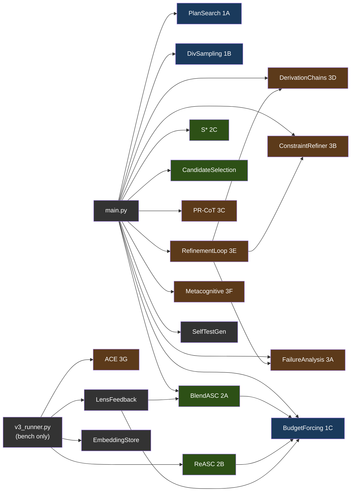

Legend: blue = Phase 1 (generation), green = Phase 2 (selection), brown = Phase 3 (repair), gray = utilities. Modules fed by `v3_runner.py` are bench-runner-only; the service does not call them.

---

## 5. Geometric Lens

Neural scoring system that evaluates code quality without executing it by analyzing the geometric structure of model embeddings. Runs entirely on CPU. Also serves as the RAG API for project indexing, retrieval, confidence routing, and pattern caching.

#### Why "Geometric Lens"?

The core idea behind the Geometric Lens comes from a simple premise: stop scaling models and start wrapping them in supporting infrastructure. Jose Crespo's ["Everyone's Wrong About AI Programming"](https://www.josecrespophd.org/p/everyones-wrong-about-ai-programming) argues that AI-generated code drifts toward errors because current LLMs operate in flat embedding spaces where correct and incorrect code paths cost the same. The solution is to build an energy landscape around the model where correct code is "downhill" and incorrect code is "uphill."

Anthropic's [Manipulating Manifolds](https://transformer-circuits.pub/2025/linebreaks/index.html) research provides evidence that transformers already create manipulable geometric structures in their embedding space - the raw material is already there. Bar et al.'s [Geometric Unification of Generative AI](https://arxiv.org/html/2510.00666v1) formalizes how distance functions on data manifolds can be learned and used for scoring.

ATLAS implements this with two complementary models. C(x) is a learned energy function (`hidden_dim`→512→128→1 MLP) over the selected model's own embeddings. Each code candidate gets embedded by llama-server, and C(x) scores where it sits in that geometry. Low energy means the candidate clusters with known-correct code. High energy means it clusters with known-incorrect code. No external oracle, no execution required—just the geometry of the selected model's representations.

G(x) is the quality predictor - an XGBoost classifier over PCA-reduced embeddings that predicts pass/fail from where a candidate sits in the reduced space. Where C(x) answers "how good is this candidate?", G(x) answers "is this candidate likely to pass?" It is the only G(x) implementation: the earlier metric-tensor formulation and its correctability endpoint were removed once XGBoost became the deployed path (see git history for the geometry-aware variant).

### Scoring Models

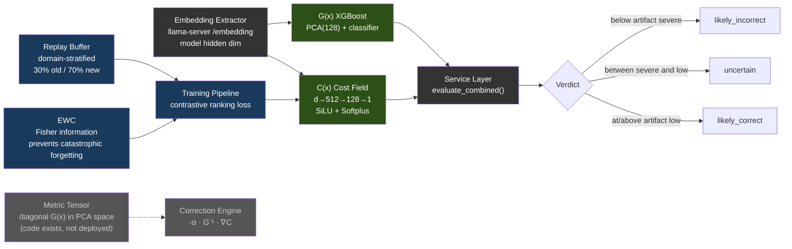

The following figures describe the frozen reference artifacts used for the
published V3 study; they are provenance, not runtime dimensions or defaults:

| Model | Reference architecture | Training Data | Performance |
|-------|-------------|---------------|-------------|
| **C(x)** | 4096→512→128→1 MLP (SiLU, Softplus) | 597 LCB embeddings (504 PASS, 93 FAIL) | Val AUC 0.9467, sep 2.04x |
| **G(x)** | PCA(4096→128) + XGBoost | 13,398 embeddings (4,835 PASS, 8,563 FAIL) | PCA 80.8% variance |

C(x) normalization is `sigmoid(steepness × (energy - midpoint))`. The
selected model's `cx_normalization.json` supplies both values; `atlas lens
build` derives them from that model's labeled PASS/FAIL candidates. G(x)
verdict thresholds likewise come from `gx_thresholds.json`. Without either
calibration, normalized decisions stay neutral/uncalibrated rather than
borrowing the reference artifact's scale.

Every current Lens bundle also contains `model_identity.json`. The service
requires its model name to match the served-model id reported by
llama-server's `/v1/models` (with `ATLAS_MODEL_NAME` as the fallback when the
probe fails); embedding-width equality alone cannot establish compatibility
between two different models.

> **Note:** Model weights (.pt, .pkl files) are not committed to the repository — they are built during training and baked into the container image or mounted at runtime. When model files are absent, the service degrades gracefully: C(x) returns neutral energy, G(x) returns `gx_score: 0.5` and `verdict: "unavailable"`. Training data and weights are available on [HuggingFace](https://huggingface.co/datasets/itigges22/ATLAS).

### RAG / PageIndex V2

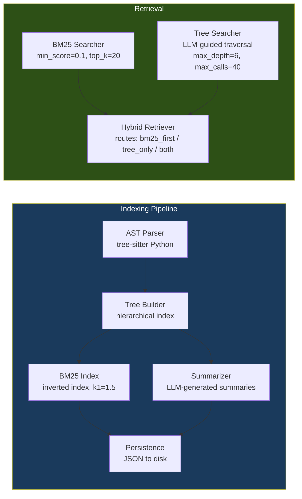

### Confidence Router & Pattern Cache

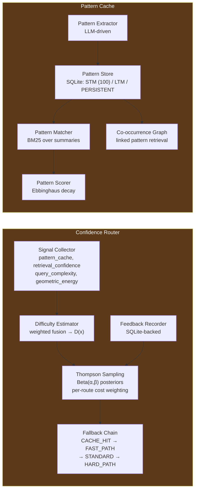

4 routes with cost-weighted Thompson Sampling: CACHE_HIT (cost=1, k=0) → FAST_PATH (cost=50, k=1) → STANDARD (cost=300, k=5) → HARD_PATH (cost=1500, k=20).

---

## 6. Sandbox

Isolated code execution with compilation, testing, and linting.

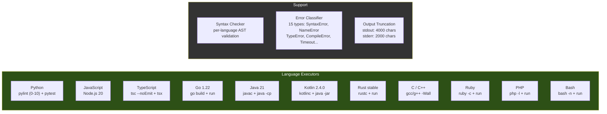

Language aliases accepted: `py`/`python3` (Python), `js`/`node` (JavaScript), `ts` (TypeScript), `golang` (Go), `java` (Java), `kt`/`kts` (Kotlin), `rs` (Rust), `c++` (C++), `rb` (Ruby), `php` (PHP), `sh`/`shell` (Bash). Common CLI tools are baked into the image (`git`, `sqlite3`, `jq`, `patch`, `zip`/`unzip`, `xz`, `curl`) plus binary-inspection tools (`strings`, `objdump`, `readelf`, `nm` via binutils, and `file`, `xxd`) — the container is non-root on a read-only base, so anything a task shells out to must be preinstalled; nothing can be apt-installed at runtime. `read_file` on a binary returns a pointer to these tools rather than raw bytes. Max execution time: 300s in the Docker deployment (compose sets `MAX_EXECUTION_TIME=${ATLAS_SANDBOX_MAX_EXECUTION_TIME:-300}` to match the proxy's 5-min `run_command` cap; the bare code default is 60s). Memory, CPU, and process caps are container-level: compose sets `mem_limit ${ATLAS_SANDBOX_MEM:-4g}`, `cpus ${ATLAS_SANDBOX_CPUS:-2}`, and `pids_limit ${ATLAS_SANDBOX_PIDS:-1024}`; `atlas init` writes host-appropriate values (~75% of RAM and cores) into `.env`. Two workspace paths: **`/execute`** (V3 candidate-test path) uses an ephemeral scratch dir under `/tmp/sandbox` (tmpfs); **`/shell`** (the agent's `run_command` route, plus `/jobs/*` for background processes) runs against `/workspace` — the bind-mounted project root from `ATLAS_PROJECT_DIR` (Docker) or hostPath `${ATLAS_PROJECTS_DIR}` (K3s), the same path the proxy sees.

---

## 7. Example VRAM Budget

One measured RTX 5060 Ti 16GB deployment using a 9B Q6 model and 32K context:

| Component | VRAM |
|-----------|------|
| Qwen3.5-9B-Q6_K model weights | ~6.9 GB |
| KV cache (32K context) | ~1.3 GB |
| **Total llama-server** | **~8.2 GB** |
| Geometric Lens | 0 (CPU-only, ~12 MB RAM for models, ~128 MB for PyTorch runtime) |
| v3-service | 0 (CPU-only) |
| sandbox | 0 (CPU-only) |
| atlas-proxy | 0 (Go binary, ~30 MB RAM) |
| **Free VRAM** | **~7.8 GB** |

All computation outside of llama-server runs on CPU. The GPU is used exclusively for LLM inference and embedding extraction.

### 7.1 VRAM Budget per Backend

The 8.2 GB / 7.8 GB-free split above is an example, not an ATLAS model default. Actual usage follows the model, quantization, context, and parallel-slot settings selected by `atlas init`. Other backends differ structurally:

| Backend | Reported "VRAM" | Realistic budget under load | Notes |
|---|---|---|---|
| **CUDA** (dedicated VRAM) | Hardware spec (16 GB on the canonical 5060 Ti) | ~95% of spec (driver reserves ~500 MB) | The numbers in the table above apply directly. |
| **ROCm** (dedicated VRAM) | Hardware spec | ~90–95% of spec (HIP runtime slightly heavier than CUDA's) | RX 7900 XTX (24 GB) → comfortably runs 14B Q5 + 32K context with 2 parallel slots. |
| **Metal** (Apple unified) | Total system RAM | **~70%** of system RAM | OS + browser + IDE eat ~30%. A 16 GB MBP has a *realistic* 11 GB budget — little headroom for Qwen3.5-9B Q6_K (~6.9 GB weights + ~1.3 GB KV at 32K, per §7) once macOS's own GPU working set is on the same memory. Use Q4_K_M (5 GB) on ≤16 GB; Q6_K wants ≥24 GB unified. |
| **Vulkan** (cross-vendor) | Hardware spec | No measured deployment yet (Preview — validated on the lavapipe CPU path only) | Expect ~20–40% below a tuned native backend on the same card. |
| **SYCL** (Intel Arc) | Hardware spec | Roadmap — Intel Arc uses Vulkan today | A770 (16 GB) target is conservative-equivalent to NVIDIA 16 GB. |

---

## 8. Deployment

Service dependency graph (identical across deployment modes):

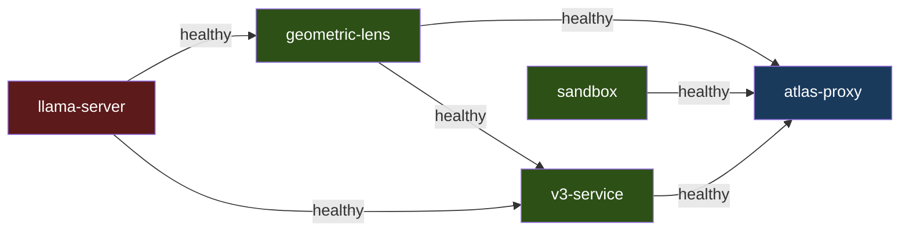

`llama-server` and `sandbox` start independently. `geometric-lens` waits for `llama-server` to be healthy; `v3-service` waits for `llama-server` and `geometric-lens`; `atlas-proxy` waits for `llama-server`, `geometric-lens`, `v3-service`, and `sandbox`. The same `inference/entrypoint-v3.1.sh` drives Docker Compose, bare metal, and K3s, so context size, KV cache quantization, flash attention, and mlock are env-var-controlled and behavior is identical across those modes; the macOS hybrid path launches native llama-server via `scripts/atlas-llama-macos.sh`, which mirrors the entrypoint's flags.

Install and per-mode bring-up steps (NVIDIA / ROCm overrides, bare metal, macOS hybrid Metal, K3s manifests) are in [SETUP.md](SETUP.md); the macOS native path is in [SETUP_MACOS.md](SETUP_MACOS.md).

---

## 9. Data Flow

### T1: Simple File Write

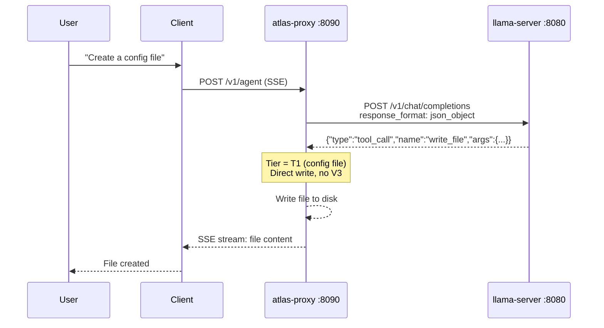

One LLM call. No V3 overhead.

### T2: Feature File Write

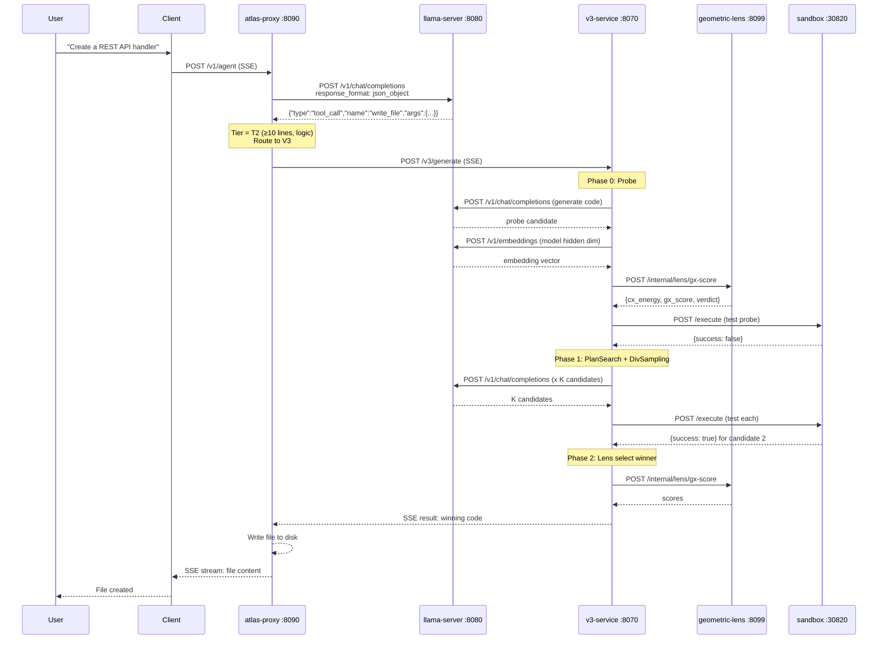

Minimum 3 llama-server calls for algorithmic tasks (1 probe generation + 1 self-test generation + 1 embedding extraction); interactive tasks (games, UIs, framework code) skip self-test generation, so their minimum is 2. Maximum 30+ if Phase 3 repair engages all strategies.

### Edit Existing Code

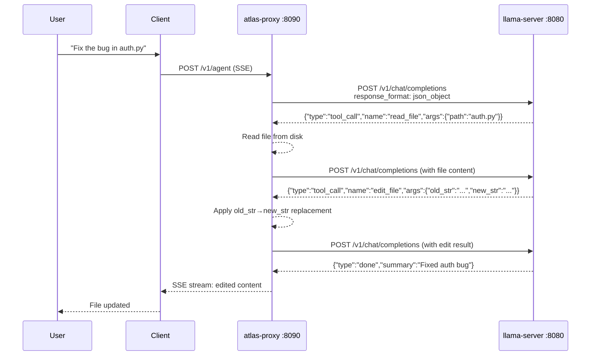

Existing files over 5 lines are rejected for `write_file` — the model must use `edit_file` (surgical, ≤10 lines) or `ast_edit` (whole-node rewrite, .py/.html/.htm only). On `.py`/`.html`/`.htm` files, the per-step grammar gate (BiasBusters #2) actively bans `edit_file`/`write_file` from the tool-name production for the next decision so the model can't relapse to the wrong shortcut.
